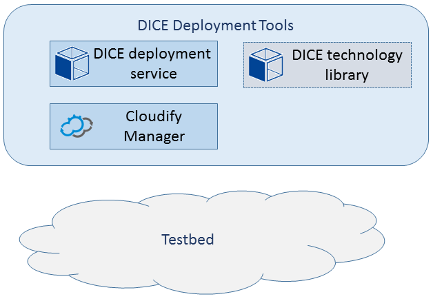

# DICE deployment service

## Introduction

The DICE deployment service is a web service and a set of tools, which provide
an abstraction of an orchestration tool. Cloud orchestrator turns application
and service definitions (also named **blueprints**) into actual deployments
of the applications and services.

The service simplifes the way that the deployments are handled. We designed the
service particularly with Continuous Integration and Continuous Deployment in
mind. The ease of use also comes from the fact that we use
[OASIS TOSCA]
as the specification of choice for describing blueprints.

To use the benefits of the service, the administrator needs to only install two
services: an instance of the third-party [Cloudify]
orchestrator, and an instance of the DICE deployment service. From that point
on, the use of the Cloudify is transparent, because the DICE deployment service
takes care of the required interfacing with the orchestrator.

Employing such a strong back-end for the DICE deployment service, the users can
use any blueprint compatible with the Cloudify's variant of the TOSCA blueprints
to preform the deployments. Additionally, DICE provides a
[DICE technology library]
to further ease the blueprint creation, praticularly for data-intensive
applications.

The following figure illustrates all the components, which comprise the DICE
deployment tools:

The DICE deployment service provides a RESTful interface and a simple Web GUI
for managing deployments. It requires a running [Cloudify]
manager as a back-end to perform the actual orchestration work.

The work is a part of the [DICE]
project results. In February 2016, we had the tools' initial release. We
accompanied it with the
[D5.1 DICE delivery tools - initial version][D5.1]
project deliverable, which provides the motivation for the tools and further
details.

## Documentation

* [Prerequisites](doc/Prerequisites.md) provides prerequisites and requirements
  for installing the DICE deployment service.
* [Installation and Administrator guide](doc/AdminGuide.md) provides
  instructions on installation of the DICE deployment service.
* [User guide](doc/UserGuide.md) contains instructions for the DICE deployment
  service's end users (developers, etc.)
* [Notes for developers](doc/DevNotes.md) provide instructions and notes about
  development and testing of the DICE deployment service.

## Acknowledgement

This project has received funding from the European Union’s
[Horizon 2020] research and
innovation programme under grant agreement No. 644869.

[DICE]: http://www.dice-h2020.eu/
[OASIS TOSCA]: http://docs.oasis-open.org/tosca/TOSCA/v1.0/os/TOSCA-v1.0-os.html
[cloudify]: http://getcloudify.org/
[DICE technology library]: https://github.com/dice-project/DICE-Deployment-Cloudify
[D5.1]: http://wp.doc.ic.ac.uk/dice-h2020/wp-content/uploads/sites/75/2016/02/D5.1_DICE-delivery-tools-Initial-version.pdf
[Horizon 2020]: http://ec.europa.eu/programmes/horizon2020/
[Prerequisites-wiki]: https://github.com/dice-project/DICE-Deployment-Service/wiki/Prerequisites
[Installation-wiki]: https://github.com/dice-project/DICE-Deployment-Service/wiki/Installation
[Getting-Started-wiki]: https://github.com/dice-project/DICE-Deployment-Service/wiki/Getting-Started
[Links-and-References-wiki]: https://github.com/dice-project/DICE-Deployment-Service/wiki/Links-and-References
[Changelog-wiki]: https://github.com/dice-project/DICE-Deployment-Service/wiki/Changelog
