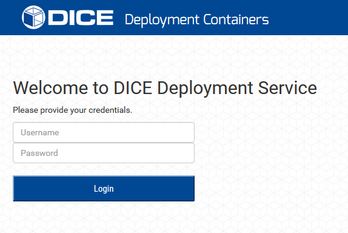
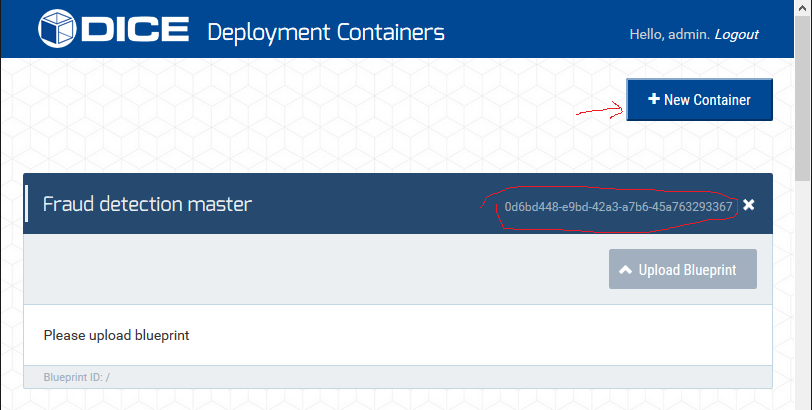
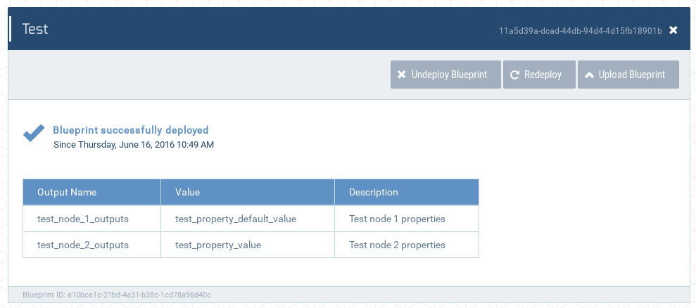
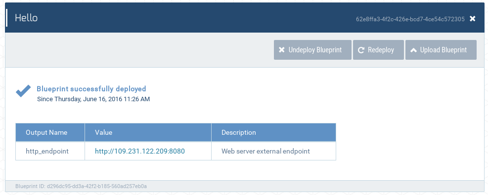

# DICE deployment service administration guide

Table of Contents:

1. [Prerequisites](#prerequisites)
1. [Cloudify command line tool installation](#cloudify-command-line-tool-installation)
1. [DICE Deployment service installation](#dice-deployment-service-installation)
1. [DICE deployment service configuration](#dice-deployment-service-configuration)
    1. [General inputs](#general-inputs)
    1. [Platform inputs](#platform-inputs)
    1. [Monitoring inputs](#monitoring-inputs)
1. [Container management](#container-management)
1. [Testing installation](#testing-installation)
1. [Monitoring support](#monitoring-support)
1. [Removing the service](#removing-the-service)


## Prerequisites

Before we can install DICE deployment service, we need to have access to
working Cloudify Manager. We need the following pieces of information about
manager:

 1. manager's IP address (`CFY_ADDRESS`),
 2. manager's port (`CFY_PORT`),
 3. manager's username and password (`CFY_USERNAME`, `CFY_PASSWORD`) and
 4. manager's certificate (`CFY_CERT`).

Alternatively, we can also install our own Cloudify Manager. Detailed
instructions on how to do that are available for:

* [OpenStack](Cloudify-OpenStack.md)
* [Amazon EC2](Cloudify-Amazon.md)
* [FCO](Cloudify-FCO.md)

Apart from Cloudify Manager, we will also need `virtualenv` command installed.
The simplest way of getting this package is to use system's package manager,
since this package is present in almost any distribution of GNU/Linux.


## Cloudify command line tool installation

The recommended way of installing the DICE Deployment service is by using
Cloudify. This requires that the workstation we are installing from has the
Cloudify's command line tool installed and configured.

We can install cfy tool using the next sequence of commands:

    $ mkdir ~/dds && cd ~/dds
    $ virtualenv venv
    $ . venv/bin/activate
    $ pip install cloudify==3.4.2
    $ pip install -U requests[security]

In order to configure the tool we need to execute:

    $ cfy init
    $ export CLOUDIFY_USERNAME=CFY_USERNAME
    $ export CLOUDIFY_PASSWORD=CFY_PASSWORD
    $ export CLOUDIFY_SSL_CERT="/path/to/CFY_CERT"
    $ cfy use -t CFY_ADDRESS --port CFY_PORT

Make sure you replace `CFY_*` placeholders with Cloudify Manager data. To test
if everything works, execute `cfy status`. This command should output
something similar to this:

    Getting management services status... [ip=109.231.122.46]
    Services:
    +--------------------------------+---------+
    |            service             |  status |
    +--------------------------------+---------+
    | InfluxDB                       | running |
    | Celery Management              | running |
    | Logstash                       | running |
    | RabbitMQ                       | running |
    | AMQP InfluxDB                  | running |
    | Manager Rest-Service           | running |
    | Cloudify UI                    | running |
    | Webserver                      | running |
    | Riemann                        | running |
    | Elasticsearch                  | running |
    +--------------------------------+---------+

If everything went well, we are now ready to start service installation.


## DICE Deployment service installation

First, we need to download the DICE deployment tools. We will be using git in
this documentation, but you can also download released tarball from Github.

    $ git clone --depth 1 --branch develop \
        https://github.com/dice-project/DICE-Deployment-Service.git
    $ cd DICE-Deployment-Service

We have tested the blueprints on Ubuntu 14.04 cloud install images, using a
flavour equivalent to 512 MB of RAM, 1 VCPU and 10 GB of storage.

Next, we must prepare the parameters in the respective inputs file. There is an
`inputs-example.yaml` file in the `install` subfolder that we will use as a
reference. We need to copy this file to the repository's root directory:

    $ cp install/inputs-example.yaml inputs.yaml

Now we must open this file, follow the comments, which explain the meaning of
each property, replace the generic values with the actual ones, and save the
inputs file.

All that is left now is to start the installation.

    $ ./up.sh inputs.yaml

The last step will take a while. When it is done, it will print the URL to
the deployment service. If this does not happen because the deployment takes
longer than the preconfigured time, use `cfy` to learn the outputs:

    $ cfy deployments outputs -d dice_deploy
    Getting outputs for deployment: dice_deploy [manager=10.10.20.115]
     - "http_endpoint":
      *  Description: Web server external endpoint
      *  Value: https://10.10.20.35

Now the RESTful interface is running and the Web interface is available. We
can visit the address listed above with our browser and we should be greeted
by a login form.



To log in, we can use the credentials set earlier in the inputs file, i.e.,
the values of the `superuser_username` and `superuser_password`.

If additional instances of the service are needed, then we need to name each
deployment differently. By default, calling `./up.sh inputs.yaml` will create
a blueprint and deployment named `dice_deploy`. If we need an instance that is
named differently, we can provide the name as a second argument to the `up.sh`
tool, e.g.:

    $ ./up.sh inputs.yaml staging_deployment

Now we must configure the service.


## DICE deployment service configuration

DICE deployment service is managed using command line tool `dice-deploy-cli`
that is available in `tools` subfolder. Complete usage instructions are
available in [user guide](UserGuide.md#command-line-tool-action-reference),
but for the sake of completeness, we will describe the commands that we need
in this document also.

First thing we need to do is obtain server certificate. We can use web browser
for this (export certificate that server identified itself with) or do some
command line magic (replace IP with your own in the next command):

    $ openssl s_client -showcerts -connect 10.10.20.35:443 < /dev/null \
        | openssl x509 -out dds.crt

Server certificate has been placed in `dds.crt` file and can be inspected by
executing

    $ openssl x509 -in dds.crt -text -noout

Now that we have server certificate available, we can configure the tool. This
is done by executing next sequence of commands (replace `user` and `pass` with
credentials for super user, set in inputs file):

    $ tools/dice-deploy-cli cacert dds.crt
    [INFO] - Settings server certificate
    [INFO] - Server certificate set successfully
    $ tools/dice-deploy-cli use https://10.10.43.120
    [INFO] - Trying to set DICE Deployment Service URL
    [INFO] - Checking DICE Deployment Service URL
    [INFO] - URL set successfully
    $ tools/dice-deploy-cli authenticate user pass
    [INFO] - Checking DICE Deployment Service URL
    [INFO] - Authenticating
    [INFO] - Authorization succeeded

If anything went wrong, tool will inform us about the error. To get even more
details, we can also consult log file `.dds.log`. And this concludes tool
configuration. Now we need to set server's inputs.

The TOSCA blueprints can define a list of parameters called
[inputs][cfy-spec-inputs]. In DICE technology library, we use the inputs to
provide elements related to the environment or the platform in which the
application is being deployed. Considering that this configuration is
relatively static for each instance of the DICE deployment service, the
administrator has to load it only once, but before the first application can
be deployed. The inputs needed therefore depend on the target platform
(OpenStack, FCO, etc.). It is of course possible to provide additional inputs
depending on the needs of the application blueprints. In the following
subsections we provide the minimum inputs list that is common to all the DICE
technology library supported blueprints.

To get a template of required inputs, we can use `tools/blueprint-helper.py`
script. To generate it, we execute

    $ tools/blueprint-helper.py example/test-server.yaml \
        inputs --format dice > template.json

Now we must open the generated file and fill in the details. Required inputs
can be found by simply searching for the string `REPLACE_ME` in the file.
Detailed description of each input can be found in the sections below.

When we have our inputs ready, we can proceed and upload them to DICE
deployment service by executing

    $ tools/dice-deploy-cli set-inputs template-openstack.json
    [INFO] - Checking DICE Deployment Service URL
    [INFO] - Checking DICE Deployment Service authentication data
    [INFO] - Replacing service inputs
    [INFO] - Successfully updated inputs

And this is it. We successfully configured DICE deployment service that is now
fully operational.


### General inputs

These inputs are not platform specific.

  * `{ ubuntu | centos }_agent_user`: Defines the name of the Linux
    user pre-installed and available on the VMs provisioned from the cloud
    image. This user has to be a sudoer, configured to run sudo without a
    password prompt. The `ubuntu_agent_user` is used on Ubuntu 14.04 servers,
    and there it is usually `ubuntu`, as indicated by default value for this
    input. The `centos_agent_user` will be used on CentOS 7 servers, where the
    value is usually `centos`.
  * `dns_server`: Defines the address of the internal DNS server. This should
    be set to the internal address of the DICE Deployment Service.


### Platform inputs

The platform inputs consist of the following information:

  * `platform`: Name of the platform that is used to deploy blueprints. Valid
    values are `aws`, `fco` and `openstack`.
  * `{ ubuntu | centos }_image_id`: The ID of the VM image to be used for
    provisioning an Ubuntu 14.04 or CentOS 7 VM instance, respectively.
    On OpenStack and FCO platform, this is UUID of the image. On Amazon EC2,
    this is AMI ID.
  * `{ small | medium | large }_instance_type`: the UUID of the flavour to
    be used when provisioning the VMs. A small instance normally has 512 MB of
    RAM, the medium instance has 1 GB or 2 GB of RAM, a large instance has at
    least 4 GB of RAM.
  * `{ small | medium | large }_disk_type`: The name of the small, medium and
    large storage type as defined in the FCO. For Amazon and OpenStack
    platforms, these inputs can be set to arbitrary values, since they are
    ignored by the orchestrator.


### Monitoring inputs

DICE TOSCA Library has integrated support for application monitoring. In order
to use monitoring, we must have access to Dmon server that applications will
report to. Setting up Dmon server is out of scope for this document. Consult
[monitoring tool documentation][dmon-docs] for more information about Dmon.

Pieces of configuration data that we need from Dmon are:

  * `dmon_address`: Main dmon address (eg. 10.50.51.4:5001).
  * `logstash_graphite_address`: Graphite address (eg. 10.50.51.4:5002).
  * `logstash_lumberjack_address`: Lumberjack address (eg. 10.50.51:5003).
  * `logstash_lumberjack_crt`: Lumberjack certificate.
  * `logstash_udp_address`: Logstash udp address (eg. 10.50.51.4:25826).


## Container management

With the Cloudify Manager installed and the DICE deployment service installed
and configured, the users can now start using the service. But to be able to
submit their application deployments, they need to have virtual containers in
place to submit their blueprints to.

To do that in GUI, log in and click on the "**+ New Container**" button at the
top right of the page (marked with an arrow in the picture below). A prompt
will ask for a short description of the new container.  In our example, we
named the container "Fraud detection master", imagining that we are developing
a fraud detection application, and this container will be used by the
Continuous Integration to validate the master branch of the development.



Each container is identified by a UUID. In the image above, the UUID is
circled in red: `62e8ffa3-4f2c-426e-bcd7-4ce54c572305`. Provide this UUID to
the developers or use it in the CI job.

Using the command line interface, adding a new container can be done with the
following call:

```bash
$ dice-deploy-cli create "Fraud detection master"
DONE.
Container UUID: 75570440-545c-42ed-a677-c54732783e67
```

In this case we receive the UUID of the newly created container in the console.


## Testing installation

In order to make sure everything works as expected, there are a few test
blueprints provided in [examples](../example/) folder that should be uploaded
to some container on freshly installed service.

First blueprint that should be uploaded is
[test-setup.yaml](../example/test-setup.yaml). This blueprint does not use any
external dependencies and creates no physical nodes (virtual machines, etc.).
This makes it perfect for testing if all of the pieces are properly wired
together. If the test succeeds, container in UI should look something like the
screenshot below.



Second blueprint that should be uploaded is one of the
`test-server-<platform>.yaml`, depending on the platform where service is
installed. This blueprint will create a single virtual machine and install
demo web server that serves static file onto it.



If all of the tests finished, deployment service is set up correctly and ready
for real work.


## Monitoring support

We have already seen that there are some inputs that control monitoring
support. But this is only the first half of the monitoring story, since
setting the appropriate inputs only saves the configuration of the monitoring
service for any blueprints that require monitored nodes. To actually monitor
application being deployed, we must enable this explicitly in blueprint.
Consult [example blueprint with monitoring enabled][blue-monitored] for more
information.


[cfy-spec-inputs]: http://docs.getcloudify.org/3.4.0/blueprints/spec-inputs/
[Prerequisites-wiki]: https://github.com/dice-project/DICE-Deployment-Service/wiki/Prerequisites
[Installation-wiki]: https://github.com/dice-project/DICE-Deployment-Service/wiki/Installation
[Getting-Started-wiki]: https://github.com/dice-project/DICE-Deployment-Service/wiki/Getting-Started
[Links-and-References-wiki]: https://github.com/dice-project/DICE-Deployment-Service/wiki/Links-and-References
[Changelog-wiki]: https://github.com/dice-project/DICE-Deployment-Service/wiki/Changelog
[dmon-docs]: https://github.com/dice-project/DICE-Knowledge-Repository/wiki/DICE-Knowledge-Repository#monitoring
[blue-monitored]: https://github.com/dice-project/DICE-Deployment-Examples/blob/master/storm/storm-openstack-monitored.yaml


## Removing the service

Tearing down the deployment service is then as easy as running the `dw.sh`
script:

    $ ./dw.sh

By default, this script will remove the deployment and blueprint named
`dice_deploy`. It is possible to supply a different name as a parameter, e.g.:

    $ ./dw.sh staging_deployment
